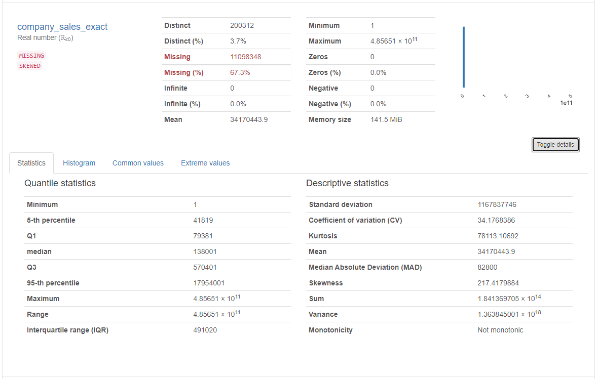

<p align="center">

</p>


# US Companies Sales Volume Prediction.
DL project for prediction of sales volumes for US companies based on minimal opened info
kind of:
1. City,
2. State,
3. ZIP code,
4. Business Specialty,
5. Business Started Year,
6. Number of Employees.

## Data.
As an input data it have been used the preprocessed
[US BUSINESS DATABASE](https://www.uscompanieslist.com/) dated Apr.2023.

## Model.
### Model Targets:
The DL Regression model provides prediction for `"company_sales"` which is
a cross-merged result for two variables from original dataset:
1. `"company_sale_volume_exact"`:
<p align="left">

</p>

2. `"company_sales_exact"`:
<p align="left">

</p>

### Model Inputs:
```
{
    "addr_city":            [string]     #  ["Newport Beach"]
    "addr_state":           [string]     #  ["CA"]
    "addr_zip_4":           [string]     #  ["6945"]
    "business_specialty":   [string]     #  ["Mens And Boys Clothing Stores"]
    "company_started_year": [string]     #  ["1996"]
    "company_employees":    [string]     #  ["10 to 19"]
}
```

### Model Outputs:
The origin model's output is the list of np.arrayes with the predicted volumes of sales:
```
array([[138153.5]], dtype=float32),
```

### The Base MLP (Multilayer Perceptron ) Model Architecture:
The model is a canonical NN with some embedded input layers.


### The [TabTransformer](https://arxiv.org/abs/2012.06678) Model Architecture:
The TabTransformer is built upon self-attention based Transformers.
The Transformer layers transform the embeddings of categorical features
into robust contextual embeddings to achieve higher predictive accuracy.


----
